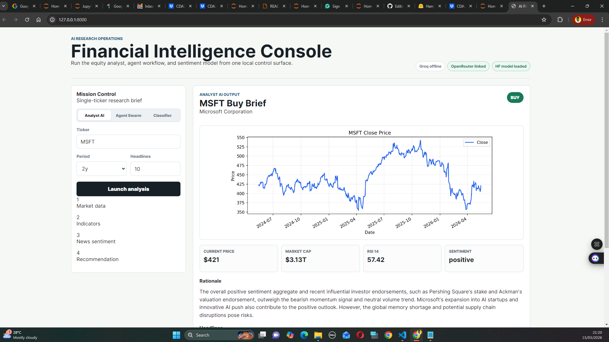

# CDAZZDEV Senior MLE Assessment (Task 1 + Task 2 + Task 3)

## Scope
This repository targets:
- **Task 1** - Financial AI equity research assistant
- **Task 2** - Hugging Face fine-tuned financial sentiment classifier
- **Task 3** - Agentic financial research with memory and observability

## Layout
- `shared/` - reusable config, schemas, prompts, errors, logging
- `task1_financial/` - Task 1 implementation, notebook, outputs
- `task2_finetuning/` - Task 2 Hugging Face fine-tuning workflow, sample data, model upload path
- `task3_agentic/` - Task 3 implementation, notebook, logs, cache, outputs
- `docs/ARCHITECTURE.md` - ASCII architecture diagrams for the repository, task flows, and deployment shape
- `CITATIONS.md` - AI usage and reference disclosure
- `REFLECTION.md` - design decisions, limitations, next improvements

## Setup (Python 3.11)
1. Create a virtual environment.
   - PowerShell: `python -m venv .venv; .\.venv\Scripts\Activate.ps1`
   - CMD: `python -m venv .venv && .venv\Scripts\activate.bat`
2. Install base dependencies: `pip install -r requirements.txt`
3. Configure local environment:
   - Copy `.env.example` to `.env`
   - Set at least one provider key: `GROQ_API_KEY` **or** `OPENROUTER_API_KEY`

## Provider Requirement for Assessment
GROQ is **not mandatory** unless your assessor explicitly requires a specific provider.
This project supports either provider, so one valid key is sufficient:
- `GROQ_API_KEY`
- `OPENROUTER_API_KEY`

## API Keys
- **Groq**: sign in at `https://console.groq.com`, then create a key at `https://console.groq.com/keys`.
- **OpenRouter**: sign in at `https://openrouter.ai`, then create a key at `https://openrouter.ai/keys`.
- **Hugging Face**: sign in at `https://huggingface.co`, then create a write token at `https://huggingface.co/settings/tokens`.

Set provider keys only in your local `.env` file or terminal session. Never commit populated keys.

## Troubleshooting API Signup Errors
If Groq shows **"<email> does not belong to any organizations"** during signup:
- You likely used a workspace/SSO flow that expects an invited organization account.
- Go back and create/use a personal account first, or use a different email that is not tied to an enterprise SSO tenant.
- If your company manages Groq access, ask your admin to invite your email to the org before retrying.

If you are blocked on Groq, continue with **OpenRouter** only. The project supports either provider.

## Run
- Task 1: open and run `task1_financial/task1_equity_research.ipynb`
- Task 2: follow `task2_finetuning/README.md`
- Task 3: open and run `task3_agentic/task3_agentic_research.ipynb`

## React Client
You can run the local React client instead of printing outputs in the terminal:

```powershell
python app_server.py --port 8000
```

Then open `http://127.0.0.1:8000`.

The client exposes:
- Task 1 equity brief generation with chart/report artifact links.
- Task 3 two-agent research reports with cache toggle and raw JSON.
- Task 2 local sentiment prediction when the fine-tuned model and Task 2 dependencies are installed.

The UI is served from `client/` and uses CDN React/Babel, so no npm setup is required.

Task 3 can also be run directly from PowerShell:

```powershell
python -c "from task3_agentic.src.graph import run_two_agent_pipeline; print(run_two_agent_pipeline('MSFT')['final_report'])"
```

## Task 2 Quick Start
Task 2 uses extra Hugging Face dependencies that are isolated from the base Task 1/Task 3 environment.

```powershell
pip install -r task2_finetuning\requirements-task2.txt
python -m task2_finetuning.src.train_financial_sentiment --epochs 1
```

To upload the trained model to Hugging Face Hub:

```powershell
hf auth login
python -m task2_finetuning.src.train_financial_sentiment --epochs 1 --push-to-hub --hub-model-id YOUR_USERNAME/financial-sentiment-distilbert
```

Replace `YOUR_USERNAME` with your Hugging Face username. The model link to submit will be:

```text
https://huggingface.co/YOUR_USERNAME/financial-sentiment-distilbert
```

## Submission Checks
- [ ] Task 1 notebook executed with outputs visible
- [ ] Task 2 model trained and Hugging Face model URL submitted
- [ ] Task 3 notebook executed with outputs visible
- [ ] No credentials committed
- [ ] `CITATIONS.md` complete
- [ ] `REFLECTION.md` <= 600 words
- [ ] `task3_agentic/logs/agent_trace.jsonl` generated

## Walkthrough Link
https://www.dropbox.com/scl/fo/t16kt9xp9fhab6z0rl5aw/AD40Apmfkl27CURrKQfUFaM?rlkey=6s48g1t4f39yk8asjynvof337&st=fvs4yun7&dl=0





